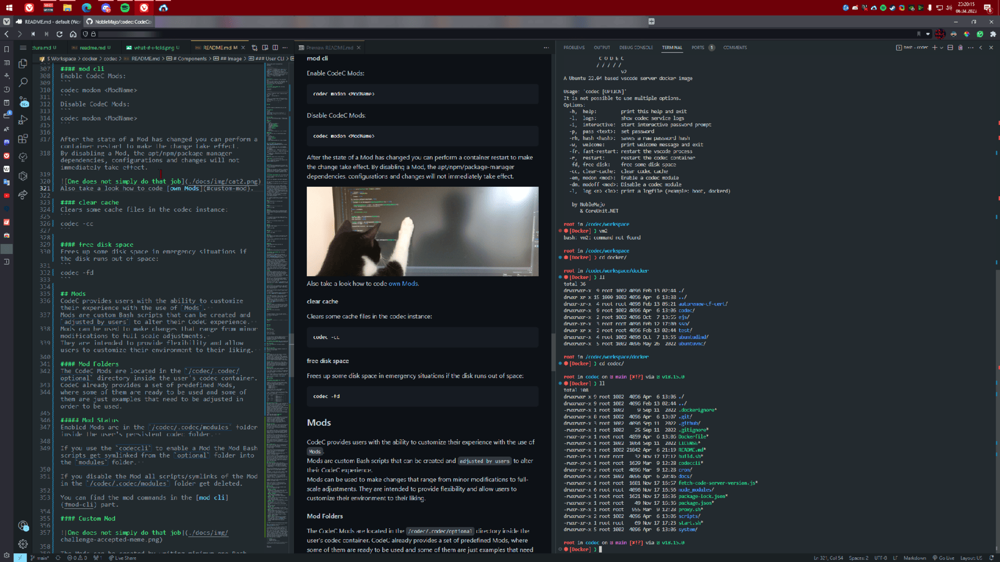
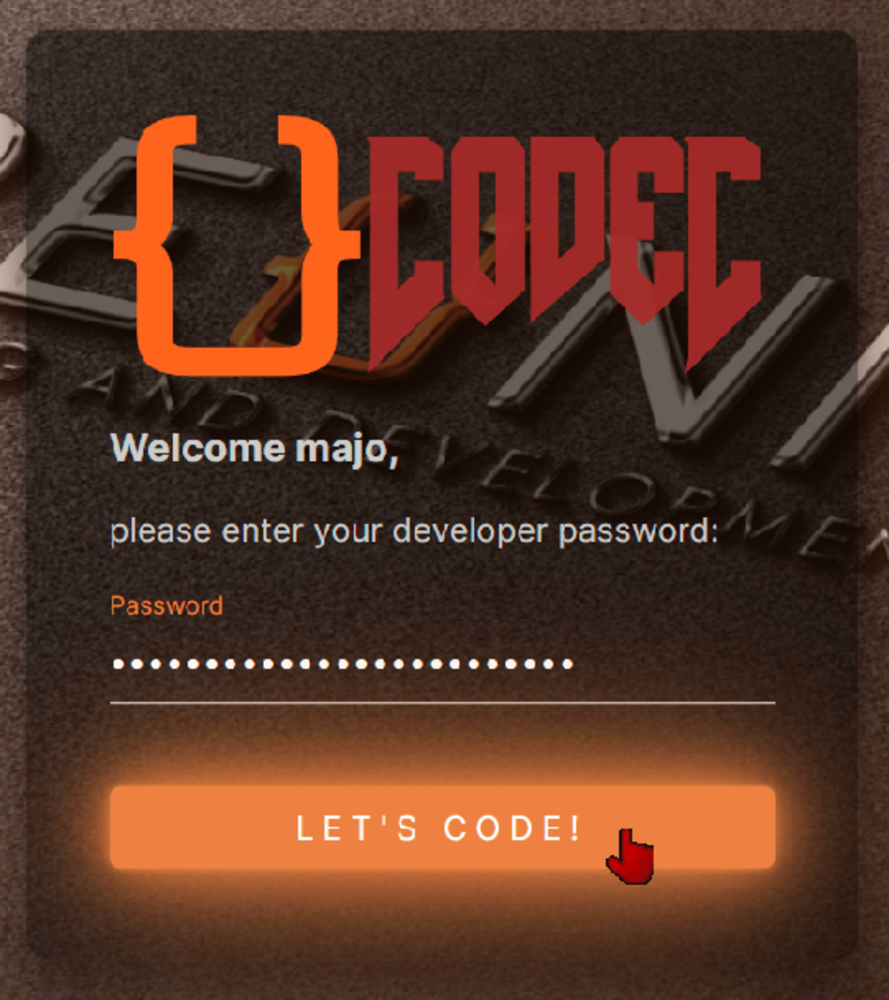
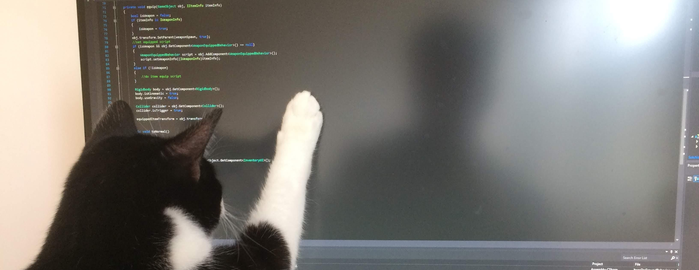
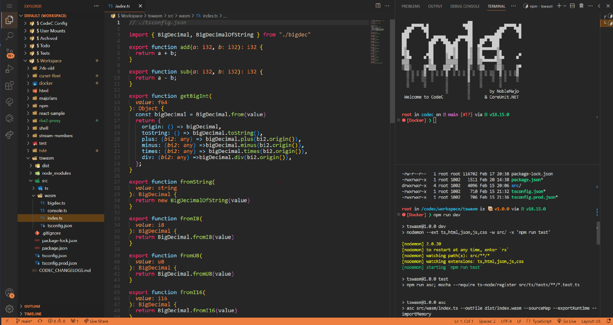
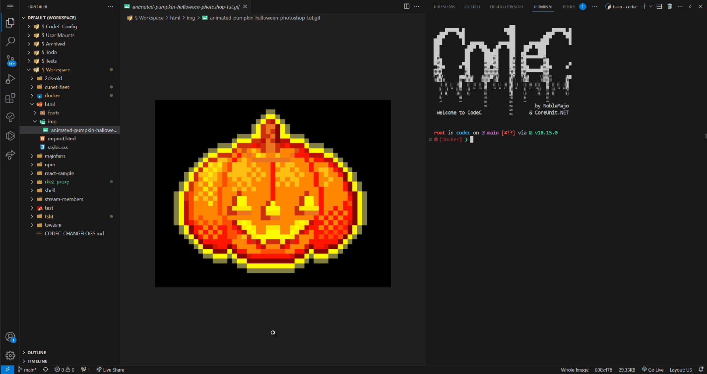
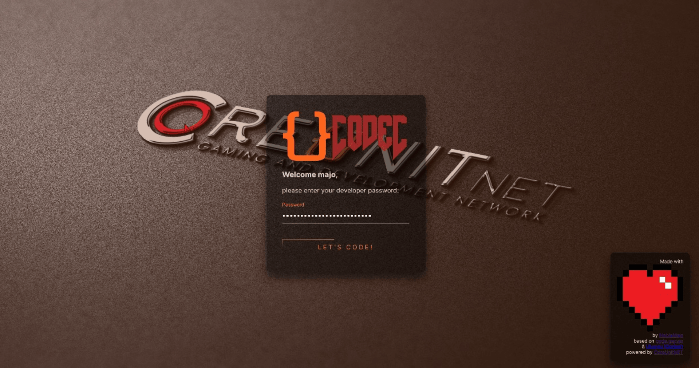

# codec ( [depricated](#depricated) )


# table of contents
- [codec](#codec)
- [table of contents](#table-of-contents)
- [about](#about)
- [depricated](#depricated)
- [base](#base)
- [Installation](#installation)
  - [Requirements](#requirements)
  - [Clone](#clone)
  - [Provider CLI](#provider-cli)
  - [Proxy setup](#proxy-setup)
    - [Secure](#secure)
    - [Unsecure](#unsecure)
    - [Proxy Configuration](#proxy-configuration)
  - [Startup](#startup)
- [Components](#components)
  - [CLI](#cli)
    - [start](#start)
    - [pass](#pass)
    - [build](#build)
    - [list](#list)
    - [logs](#logs)
    - [close](#close)
    - [reset](#reset)
    - [delete](#delete)
  - [Proxy](#proxy)
  - [Image](#image)
    - [Persistence](#persistence)
    - [Instance](#instance)
    - [User CLI](#user-cli)
  - [Mods](#mods)
    - [Example Mod](#example-mod)
  - [Mounts](#mounts)
- [folder structure](#folder-structure)
  - [User FS](#user-fs)
  - [System FS](#system-fs)
- [Preview](#preview)
- [Codec v1](#codec-v1)
  - [v1 Software](#v1-software)
  - [v1 folder structure](#v1-folder-structure)
  - [v1 Problems](#v1-problems)
  - [v2.0.0 changes](#v200-changes)
- [contribution](#contribution)

# about
CodeC is a containerized web-based Multi-User VS-Code like development environment based on coder/code-server, Docker, Ubuntu and a lot of CLI, Control and Setup Bash Scripts.

The CodeC environment consists of several software components, all of which work together to create a complete environment for the users. 

This `README.md` that you read right now is written in a CodeC environment:


# depricated
New features for this software will not be developed and support will be discontinued.
Today, the developer of this software would choose a completely different conceptual approach for the software.

# base

CodeC is based on the following Software:
| Software     | Description                                                                      |
| ------------ | -------------------------------------------------------------------------------- |
| Code-Server  | VS-Code in web by [Coder](https://github.com/coder/code-server)                  |
| Ubuntu       | The Ubuntu Docker Image on [hub.docker.com](https://hub.docker.com/_/ubuntu)     |
| Docker       | The Image is based on and tested with [Docker](https://www.docker.com)           |
| Bash scripts | The own CodeC Provider and User CLI Tools and the Setup Scripts are Bash scripts |
| More...      | Take a look at the `Dockerfile`                                                  |

# Installation
If you want to use CodeC here is the installation guide.
Please note that the CodeC is under development, may have some security issues and the CodeC provider (the person who installs and/or hosts the codec) is responsible for bugs, risks and problems.

## Requirements


| Required  | Explanation                                                                                                 |
| --------- | ----------------------------------------------------------------------------------------------------------- |
| ubuntu os | Tested with `20.04`. Should also work with `16.04` and newer.                                               |
| docker    | Working Docker CLI Tools.                                                                                   |
| sudo      | Root privileges and `sudo installed`. For Docker and changes to user data managed by CodeC user containers. |
| git       | To clone and update the repository.                                                                         |


## Clone


```bash
git clone git@github.com:NobleMajo/codec.git codec
```

## Provider CLI
```bash
cd codec
./codeccli install  # installs the CodeC CLI tool
codeccli help  # check the CLI installation
codeccli build  # triggers the build of the CodeC container image
```

## Proxy setup
Use the following commands to start a simple `CProX` proxy server for the wildcard domain `*.codec.example.com`.

### Secure
```bash
docker run \
  -v /path/to/certs:/app/certs \
  -e CERT_PATH="/app/certs" \
  -e CERT_NAME="cert1.pem" \
  -e KEY_NAME="privkey1.pem" \
  -e CA_NAME="fullchain1.pem" \
  -e VERBOSE="true" \
  --network="codec_net" \
  -p 80:80 \
  -p 443:443 \
  noblemajo/cprox \
  *.codec.example.com=PROXY:http://codec_{-4}:8080
```
### Unsecure
For an HTTP-only proxy, use the following command instead:
```bash
docker run \
  -e HTTP_PORT="80" \
  -e VERBOSE="true" \
  --network="codec_net" \
  -p 80:80 \
  noblemajo/cprox \
  *.codec.example.com=PROXY:http://codec_{-4}:8080
```

### Proxy Configuration
Here is the `CProx` Proxy Dokumentation:  
[https://github.com/noblemajo/cprox](https://github.com/noblemajo/cprox)

In the above commands, the `{-4}` is the wildcard index and defines the names of the user containers in the subdomains.  
Some examples:
- `*.codec.example.com` = `PROXY:http://codec_{-4}:8080`
- `*.codec.test.example.com` = `PROXY:http://codec_{-5}:8080`
- `*.example.com` = `PROXY:http://codec_{-3}:8080`
- `*.codec.test.intern.example.com` = `PROXY:http://codec_{-6}:8080`

## Startup
Now you are ready to start a CodeC container!


Here is a explaination how to use the `codeccli start` to start a CodeC user container:
[codeccli start](#start)


# Components
CodeC is a containerized development environment that is built using different software components to create a unified environment. 

## CLI
The CodeC CLI, also known as `codeccli`, is a provider CLI that allows a CodeC provider to control CodeC user containers on a host by starting or stopping them, modifying passwords, building or updating, and more. 

### start


To start or restart a CodeC user container, use the following command:

```bash
codeccli start <USER_NAME> <START_PORT> <PORT_COUNT>
```

Additional options for the start command include:
- `--not-privileged/-n`: Disables privileged mode for the user CodeC Docker container for `more security` and does not allow the user to use Docker in Docker. To use docker in a CodeC instance also read about the CodeC [docker mod](#mod-docker).
- `--mount-sock/-s`: Mounts the Docker socket to the starting container to `allow access to the host Docker containers`, system, and ports.
- `--read-only/-r`: Starts the container in read-only mode. CodeC is `not built to run in read-only mode`, but the option is available anyways.
- `--force/-f`: Dont ask the user if the container really should be started.

*The flags and arguments that are used will be stored for the next startup of the user except `-f` and the user name.*

After the start the container opens the code-server on port 8080.
You can access the code-server just with a configured proxy server.

Login using the given password of the `codeccli` command or change it:


### pass
Change the password of an existing users:
```bash
codeccli pass <NAME>
```

### build
The following command builds the CodeC docker image. Since the build script is executed when the start command is used, the command usually does not need to be used.
```bash
codeccli build
```

Additional options for the start command include:
- `--scratch/-s`: Build the image from scratch. That can take a few minutes.

### list
Show a list of all existing container users:
```bash
codeccli list
```

### logs
Show the systemd and CodeC service logs of an existing and running user container:
```bash
codeccli logs <NAME>
```

### close
Stop and remove an existing container:
```bash
codeccli close <NAME>
```

### reset
(This command will not delete the persisted user data except the user CodeC configuration in the listed folders below)*

Reset all files in /codec/mounts and /codec/.codec of an existing container:
```bash
codeccli reset <NAME>
```

### delete
Delete all peristend CodeC user files and configurations:
```bash
codeccli delete <NAME>
```

## Proxy
As CodeC Proxy you can use any proxy that can proxy the requests to the user container the right way.


We recommend to use [CProX](https://github.com/noblemajo/cprox), because it provides a working and easy to use/setup proxy functionality.  
In the [installation guide](#proxy-setup), you can view how to use CProX as CodeC Proxy server.

A CodeC Proxy provides users the access to their own container via their own hostname (`sub domain`).  
For example, if the CodeC is running under the wildcard subdomain `*.codec.example.com`, the user `foobar` gets access their oen CodeC instance vie the hostname `foobar.codec.example.com`.
The proxy server determines which container to proxy the incoming HTTP requests to based on the host.
For that, the proxy server needs to be in the same docker network as the CodeC container instances.

A proxy server is necessary to publish all CodeC containers http web server ports via the same tcp port (80/443).

## Image
In the context of CodeC, the image refers to the Docker image from which all CodeC user containers are started.   The image is based on one of the newest Ubuntu versions (often LTS) and includes various development tools like: `NPM`, `Node.js`, `Git`, the `code-server` (vs-code web abstraction built by [Coder](https://github.com/coder/code-server)). 

Additionally, it contains some persistent scripts that adapt all files to the CodeC persistence behavior.  
Each user gets one running CodeC container instance based on the CodeC Docker image.

The blueprint for the image is in the `Dockerfile` and can be built by the `codeccli` [build](#build) command.

### Persistence

Instead of storing all the data on disk, which would take up a lot of storage space for each Codec user, Codec just stores one folder (`/codec`) that persists across container restarts.

This way the codec provider dont needs to store a huge amount of data, but the user needs to organize their persistent data.

To manage the persistent data accross the maschine the user can use [Mods](#mods) and [Mounts](#mounts).

### Instance
In the CodeC environment, a CodeC container instance refers to a running Docker container based on the CodeC Docker image and started by the CodeC CLI-Tool.   
Each instance is running for one or more users that share one password to access the instance.  
The user can customize the instance with CodeC [Mods](#mods), CodeC [Mounts](#mounts) and build in configuration files.

### User CLI
The `codec` command is the CodeC-User-CLI Tools that users can use in the CodeC instance in their terminal.
They can use the tool to restart their own container, change passwords, and make other settings, such as enabling and disabling Mods.

#### restart
Restart the current user instance:
```
codec -r
```

The command above will restart the whole instance.
If `just the code server` makes trouble, the user can alse perform a fast restart:
```
codec -fd
```

#### password
Change the user's password of the login of the current instance:
```
codec -i
```

#### help
```
codec -h
```

#### mod cli
Enable CodeC Mods:
```
codec modon <ModName>
```
Disable CodeC Mods:
```
codec modon <ModName>
```

After the state of a Mod has changed you can perform a container restart to make the change take effect.
By disabling a Mod, the apt/npm/package-manager dependencies, configurations and changes will not immediately take effect.


Also take a look how to code [own Mods](#custom-mod).

#### clear cache
Clears some cache files in the codec instance:
```
codec -cc
```

#### free disk space
Frees up some disk space in emergency situations if the disk runs out of space:
```
codec -fd
```

## Mods
CodeC provides users with the ability to customize their experience with the use of `Mods`.  
Mods are custom Bash scripts that can be created and `adjusted by users` to alter their CodeC experience.  
Mods can be used to make changes that range from minor modifications to full-scale adjustments. 
They are intended to provide flexibility and allow users to customize their environment to their liking.  

#### Mod Folders
The CodeC Mods are located in the `/codec/.codec/mods` directory inside the user's codec container.
CodeC already provides a set of predefined Mods,
where some of them are ready to be used and some of them are just examples that need to be adjusted in order to be used.

##### Mod Status
Enabled Mods are in the `/codec/.codec/enabled-mods` folder inside the user's persistent codec folder.  

If you use the `codeccli` to enable a Mod the Mod Bash scripts get symlinked from the `mods` folder into the `enabled-mods` folder.  

If you disable the Mod all scripts/symlinks of the Mod in the `/codec/.codec/enabled-mods` folder get deleted.

You can find the mod commands in the [mod cli](#mod-cli) part.

#### Custom Mod


The Mods can be created by writing minimum one Bash script that follows a specific naming convention and placing it in the appropriate directory.  
There are four types of Mod scripts available:
 - `<ModName>.env.sh`,
 - `<ModName>.boot.sh`,
 - `<ModName>.async.sh` and 
 - `<ModName>.bash.sh`.

All Bash scripts with the same `<ModName>` are automatically count as one CodeC Mod.

Here is an table that explains the Mod script types:
| Type  | Processing | Delay container startup | Delay bash startup | Script Name          |
| ----- | ---------- | ----------------------- | ------------------ | -------------------- |
| ENV   | `sync`     | `yes`                   | `no`               | `<ModName>.env.sh`   |
| BOOT  | `sync`     | `yes`                   | `no`               | `<ModName>.boot.sh`  |
| ASYNC | `async`    | `no`                    | `no`               | `<ModName>.async.sh` |
| BASH  | `semi`     | `no`                    | `yes`              | `<ModName>.bash.sh`  |

#### Environment Mod Script
Environment scripts in CodeC are bash scripts that are executed at the boot of the container after each other. These scripts are located in the `/codec/.codec/mods` directory and `<ModName>.env.sh` is the mandatory defined naming that must be used.  
The purpose of these scripts is to install apt and npm packages and to change the configuration of tools that are used in the following boot scripts.  
The environment scripts delay the start of the CodeC web server until they finish executing.  
In the environment script, you can define apt and npm packages that should be installed using the following syntax:
```bash
export CODEC_NPM_PACKAGES="typescript"
export CODEC_APT_PACKAGES="nano"
```
All defined apt and npm packages will be collected and installed after all environment scripts are finished. In addition to installing packages, environment scripts can be used to add apt repositories or configure npm and apt, among other things.  
Overall, environment scripts provide a way to customize and prepare the environment before the container and the boot scrips starts up.

#### Boot Mod Script
The CodeC Boot scripts are executed at the boot of the container after each other. These scripts are used to perform tasks that cannot be run in parallel with other tasks, such as preparing some applications.  
`<ModName>.boot.sh` is the mandatory defined naming that must be used.

During the Boot-script phase, the environment scripts have already been run, and any apt and npm packages defined there have already been installed. Therefore, the Boot-scripts can assume that these packages are available for use.

One important aspect of the Boot-scripts is that they delay the start of the CodeC webserver until the scripts have finished executing. This ensures that any necessary preparations have been completed before the webserver starts serving requests.

Overall, Boot-scripts are an important part of the CodeC container environment, allowing for synchronization tasks and other necessary preparations to be performed before the webserver starts serving requests.

#### Async Mod Script
Async scripts are scripts that are executed after the boot scripts of the CodeC container and after the code-server webserver is available.
`<ModName>.async.sh` is the mandatory defined naming that must be used.

These scripts can be used to execute tasks that can run in parallel, such as installing additional packages, running tests, or performing other initialization tasks.  
The Async-scripts do not delay the start of the CodeC webserver because they are executed after the webserver has already started.

If there are tasks in the Boot scripts that can run in parallel with other tasks, they should be moved to the Async-scripts to decrease the container startup time and install all apps faster.  
This can help speed up the initialization process and reduce the overall time it takes for the container to become fully operational.

#### Bash Mod Script
Bash scripts are executed when a bash shell is initialized. They delay the startup of a bash terminal or shell for the user, allowing tasks that should run at initialization of a bash shell to be executed.  
`<ModName>.bash.sh` is the mandatory defined naming that must be used.

These scripts are typically used to set environment variables, aliases, or functions that should be available when the user opens a bash terminal or shell.  
For example, if a user wants to set a specific `$PATH` for a project they are working on, they can add the necessary export statements to the Bash script.

All enabled mod's Bash scripts run `synchronized` after each other. However, if the user starts a `second bash shell` or an `async script is still executed` in parallel, then the Bash script will run `in parallel` to these scripts.

The Bash-scripts do not delay the start of the CodeC webserver because they are executed after the webserver has already started.

Overall, Bash scripts are a powerful tool for configuring the user's environment and automating common tasks that need to be executed when a bash terminal or shell is initialized.

### Example Mod
Here is some examples that explain how the script types are used in different mods:

- ##### Mod: `starship`
  StarShip Shell is the minimal, blazing fast, and extremely customizable prompt for any shell!
  - `Boot`: Installation via CURL
  - `Bash`: Inizialization of StarShip in users prompt
- ##### Mod: `devtools`
  Some commonly used developments tools.
  - `Env`: Defines API Packages to install
  - `Async`: Enables the ssh agent via systemctl
- ##### Mod: `unmin`
  Installes `man` and unminifies and installes the ubuntu documentation that is normally not included in the ubuntu docker image.
  - `Env`: Installs the `man` apt package
  - `Async`: Executes the long taking unminify process
- ##### Mod: `git`
  Git is a version control system that is very commonly used.  
  Free Remote versioning solutions are GitLab and GitHub. 
  - `Bash`: Sets some git configuration and sets the user name and email
- ##### Mod: `jdk`
  Installes the java development kit based in the version inside the env script.
  - `Env`: Defines the jdk version and the apt package
- ##### Mod: `cd`
  Creates some bash scripts named `cd.`, `cd..`, `cd...` and make them executable as shortcuts.
  The count of the `.` (dots) defines how many folders the shell should go above the current working directory.
  - `Async`: Creates the bash scripts in a binary directory ($PATH variable)
- ##### Mod: `docker`
  Allows the user to use docker (for the provider: docker in docker) in their own CodeC instance.
  For this you need to have a [privileged](#start) CodeC docker container running.
  - `Async`: Enables all pre installed docker processes.

## Mounts
`!!! This section not describes Docker volumes mounts !!!`  
First, read about why we need CodeC mounts for [persistent data](#persistence).

To prevent data loss, CodeC offers a feature called `Mounts`. CodeC Mounts are symbolic links to directories outside the persistent CodeC folder (`/codec`) that are mounted into the persistent folder.

Mounts can be set in the `/codec/.codec/mounts.json` JSON file as a `key-value object`. The key is the name (*without slashes*) for mount-folder in the `/codec/mounts/` folder, and the value is the target that should be mounted into there. If the folder named by the key does not exist, the mount script at the CodeC container startup copies the existing folder into the mount folder location in `/codec/mounts/` to get the default/existing files not deleted.

# folder structure

## User FS
Because most of the following files are in the persistent `/codec` folder, all user data in there will be persistent.

- `/root/`  
  - `ws/` <- /codec
- `/usr/`
  - `bin/` <- codec bins moved to here
- `/codec/` <- persistent folder
  - `mounts/`
    - `shared/` <- `a shared folder between all CodeC instances as share and exchange folder`
    - `logs/` <- logs folder for the CodeC System and Mods,
    - `ssh/` <- `/root/.ssh`,
    - `vscode/` <- `/root/.local/share/code-server`
  - `.codec/`
    - `bin/` <- custom executable user scripts 
    - `enabled-mods` <- links to `/mods`-files
    - `mods/` <- folder with optional CodeC [Mods](#mods)
    - `mounts.json` <- file with CodeC [Mount](#mounts) configuration
  - `main/`
  - `todo/`
  - `archieved/`

| Folder/File                    | Description                                                                                                                          |
| ------------------------------ | ------------------------------------------------------------------------------------------------------------------------------------ |
| `/codec`                       | The only [persistent folder](#persistence) for the user                                                                              |
| `/codec/.codec/`               | Folder for the user with CodeC infos, configs, mods, mounts and scripts                                                              |
| `/codec/.codec/ports.info.txt` | Text file containing the ports the user can use to test/run apps on (more infos [here](#start))                                      |
| `/codec/.codec/bin/`           | Contains custom executable files used by the CodeC system                                                                            |
| `/codec/.codec/enabled-mods/`  | Directory for enabled [Mods](#mods)                                                                                                  |
| `/codec/.codec/mods/`          | Directory for optional [Mods](#mods)                                                                                                 |
| `/codec/.codec/mounts.json`    | JSON file for the user to [mount](#mounts) non-persistent files                                                                      |
| `/codec/mounts/systemd/`       | [Mount point](#mounts) for custom systemd configuration files                                                                        |
| `/codec/mounts/ssh/`           | [Mount point](#mounts) for the SSH server configuration files                                                                        |
| `/codec/mounts/vscode/`        | [Mount point](#mounts) for the code-server configuration files                                                                       |
| `/codec/workspace/`            | Directory for the main projects                                                                                                      |
| `/codec/todo/`                 | Directory for to-do projects                                                                                                         |
| `/codec/archived/`             | Directory for archived projects                                                                                                      |
| `/root/`                       | CodeC user home folder                                                                                                               |
| `/root/ws/`                    | Link to the `/codec` directory inside the users home folder (user can execute `cd; cd ws` to get into the `/codec` workspace folder) |

## System FS
The following files are intended for the CodeC container boot and health system rather than the user.  
Changes here can lead to unforeseen problems.
We recommend to use [Mods](#mods) (or [Mounts](#mounts)) for dev env customization.

- `/etc/`
  - `codec/`
    - `boot.sh`
    - `bash.sh`
    - `health.sh`
    - `skel`
      - `.codec`
        - `...skel...
      - `mounts`
        - `vscode`
    - `ports.info.txt`

| Folder/File            | Description                                                                                                         |
| ---------------------- | ------------------------------------------------------------------------------------------------------------------- |
| `/etc/codec`           | System CodeC folder with all needed boot, skeleton and initialization files                                         |
| `/etc/codec/boot.sh`   | Bash script that runs on container start-up. This will trigger the [Env, Async and Boot Mod Scripts](#custom-mod).  |
| `/etc/codec/bash.sh`   | Bash script that runs on bash shell start-up like `.bashrc`. This will trigger the [Bash Mod Scripts](#custom-mod). |
| `/etc/codec/health.sh` | Bash script to check and repair desired CodeC state of folder and file structures                                   |
| `/etc/codec/skel/`     | Skeleton directory used for the [user's CodeC folder](#user-fs) `/codec/.codec` below                               |

# Preview





# Codec v1
'Codec' v1 was successful, but not very well thought-out software.  
'Codec' stands for **Code-C**ontainer* and wasn't written as "CodeC" back then.  

## v1 Software 

The software used by Codec back then included `Ubuntu v20.04`, `Code Server v3` (*by Coder*), `dind` (*docker-in-docker docker-hub image*), `Git`, `Node v16`, and `NPM v8`, with an `unminimized ubuntu docker image`. Codec components included `Codec bins`, a own  `Codec Linux user`, and a `boot` and a `bash script`.

## v1 folder structure 

In codec version 1, the folder structure consisted of a home directory with a Codec folder. Inside the Codec folder, there was a hidden ".codec" directory that contained bin and skel folders, as well as a docker-entrypoint.sh script. 

- `/home`
  - `/codec`
    - `/.codec`
      - `/bin`
      - `/skel`
      - `/docker-entrypoint.sh`
    - `/ws` <- Persistend directory
      - `/.codec`
        - `/bin`
        - `/boot.sh`
        - `/bash.sh`
        - `/default.code-workspace`
        - `/ports.txt`
        - ...etc...
      - `/main`
      - `/todo`
      - `/test`
    - ...etc...

The `~` folder was the users home folder at `/home/codec`.

| Folder/File                          | Description                                                         |
| ------------------------------------ | ------------------------------------------------------------------- |
| `~/.codec/bin`                       | Contains executable files used by the codec system                  |
| `~/.codec/skel`                      | Skeleton directory used for users codec folder `~/ws/.codec` below  |
| `~/.codec/docker-entrypoint.sh`      | Entrypoint script for the codec container                           |
| `~/ws`                               | Only persistent folder for the user                                 |
| `~/ws/main`                          | Directory for the main projects                                     |
| `~/ws/todo`                          | Directory for to-do projects                                        |
| `~/ws/.codec/boot.sh`                | Bash script that runs on container start up                         |
| `~/ws/.codec/bash.sh`                | Bash script that runs on bash shell start up like `.bashrc`         |
| `~/ws/.codec/ports.txt`              | Text file containing the ports the user can use to test/run apps on |
| `~/ws/.codec/default.code-workspace` | Default workspace file for the code-server                          |

## v1 Problems
With Codec 1 we gained experience and analyzed some pain points and difficulties that were not easy to patch out.  
Therefore, CodeC 2.0.0 was developed, which was completely overhauled, solved many issues and brought many new features and possibilities with it.

## v2.0.0 changes
Software Changes:
- `+` Added Systemd
- `*` Updated to Ubuntu v22.04 LTS (until then v20.04)
- `*` Updated to VSCode Server v4.* (until then v3.*)

Component Changes:
- `-` Removed Codec Linux user
- `-` Removed the boot and bash-init script
- `+` Added Codec mods system
- `+` Added Codec systemd service
- `+` Added health check boot script
- `*` Updated custom CLI tools
- `*` Updated Codec user CLI

# contribution
 - 1. fork the project
 - 2. implement your idea
 - 3. create a pull/merge request
```ts
// please create seperated forks for different kind of featues/ideas/structure changes/implementations
```

---
**cya ;3**  
*by NobleMajo*


